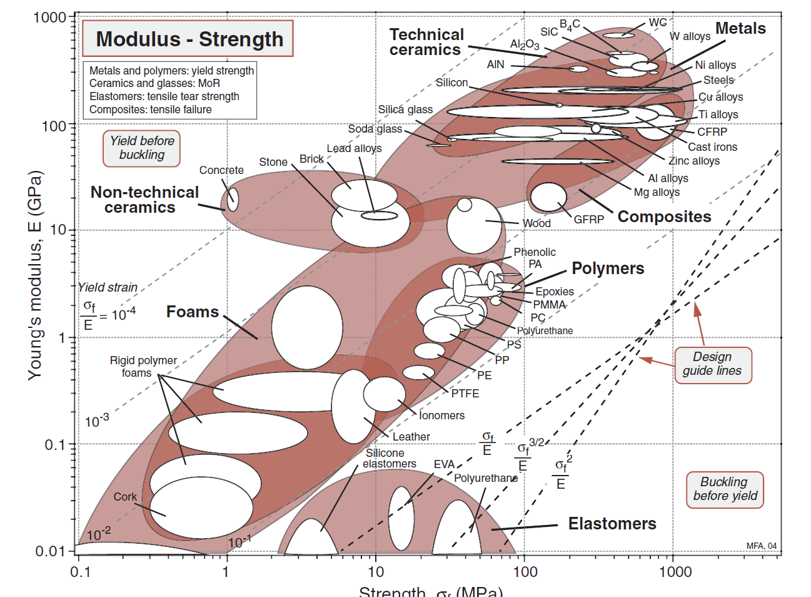
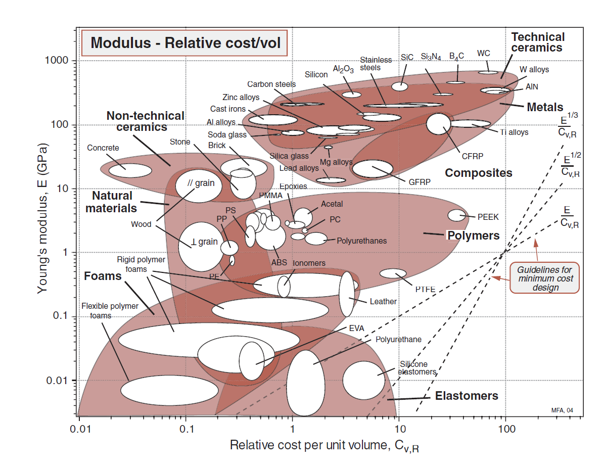

# Smart Wearable Activity Tracker

  
   
  <em>Portfolio hero image based on the final SOLIDWORKS Visualize render of the wearable activity tracker.</em>

## Project Overview

A wearable activity tracking device developed to investigate the challenges of thermal management, water resistance, user comfort, manufacturability, and cost within a compact consumer product.

---

## Engineering Problem

Commercial wearable devices are expected to operate reliably in a variety of everyday conditions while remaining lightweight, comfortable, durable, and affordable. Achieving these requirements becomes particularly challenging when electronic components, batteries, and sensing hardware must be packaged within a compact enclosure.

The objective of this project was not simply to create a functioning step counter. The objective was to investigate whether a low-cost wearable device could satisfy several competing engineering requirements simultaneously.

The primary challenge involved balancing thermal management and environmental protection within a compact enclosure. Improved cooling generally requires increased airflow, while improved water resistance requires restricting airflow pathways. These requirements directly conflict with one another and must be carefully balanced during the design process.

Additional constraints included user comfort, battery endurance, structural integrity, manufacturability using FDM additive manufacturing, and overall product cost. The project therefore became a multidisciplinary engineering exercise involving mechanical design, material selection, thermal management, product development, and design-for-manufacturing principles.

The final goal was to develop a practical wearable activity tracker capable of satisfying user requirements while demonstrating a structured engineering design process supported by analysis, trade-off evaluation, and validation.

---

## Design Requirements

A Product Design Specification (PDS) was developed to translate user needs into measurable engineering requirements.

### Functional Requirements

- Accurately record and display step-count information.
- Operate continuously during normal daily activities.
- Provide reliable performance during walking, jogging, and general movement.

### User Requirements

- Comfortable for extended daily use.
- Lightweight and unobtrusive.
- Simple to wear and operate.
- Suitable for students and everyday users.

### Thermal Requirements

- External surface temperature shall remain below 45°C during operation and charging.
- Internal heat generation shall not compromise electronic component reliability.

### Environmental Requirements

- Resist exposure to sweat and light rain.
- Minimise the likelihood of moisture ingress during normal use.
- Maintain functionality under typical outdoor conditions.

### Mechanical Requirements

- Withstand accidental drops and routine handling.
- Maintain structural integrity throughout normal service life.
- Prevent excessive deformation of wearable components.

### Manufacturing Requirements

- Compatible with FDM additive manufacturing processes.
- Minimise support material requirements.
- Utilise commercially available materials and components.

### Cost Requirements

- Maintain a low prototype manufacturing cost.
- Prioritise affordability without compromising essential functionality and reliability.

---

## Design Objectives

The project was approached as a multi-objective engineering design problem rather than a device-construction exercise.

The primary objective was to develop a wearable activity tracker capable of satisfying user and functional requirements while maintaining low manufacturing cost and low device mass.

Secondary objectives included:

- Maintaining thermal safety during operation and charging.
- Reducing the likelihood of moisture ingress.
- Maximising user comfort during prolonged use.
- Ensuring compatibility with desktop FDM additive manufacturing.
- Achieving acceptable structural robustness for everyday use.
- Supporting straightforward assembly and maintenance.

Because these objectives often conflicted with one another, the final design was developed through systematic engineering trade-off analysis rather than optimisation of a single performance metric.

## Free Variables

Several design parameters remained adjustable throughout the development process and were therefore treated as free variables during the design process.

### Material Variables

- Enclosure material selection.
- Flexible component material selection.
- Wall thickness selection.
- Material distribution within the enclosure.

### Geometric Variables

- Enclosure dimensions.
- Wall geometry.
- Vent configuration.
- Snap-fit geometry.
- Strap architecture.
- Internal component placement.

### Manufacturing Variables

- Print orientation.
- Layer thickness.
- Infill density.
- Support strategy.
- Assembly methodology.

These free variables were adjusted throughout development to achieve the project objectives while satisfying thermal, environmental, manufacturing, and structural constraints.

---
## Design Variables and Fixed Parameters

To support systematic engineering decision-making, project parameters were separated into fixed parameters and adjustable design variables.

### Fixed Parameters

The following parameters were considered fixed throughout development:

- Wearable activity-tracking functionality.
- Intended operating environment.
- Daily-use operating conditions.
- User comfort requirements.
- Budget limitations.
- FDM manufacturing requirement.
- Target level of environmental protection.

These requirements could not be changed and therefore formed the basis of the design process.

### Adjustable Design Variables

The following variables could be modified throughout design development:

- Material selection.
- Wall thickness.
- Enclosure geometry.
- Component arrangement.
- Ventilation strategy.
- Sealing strategy.
- Strap configuration.
- Manufacturing settings.

These variables were adjusted iteratively to satisfy project objectives while remaining within engineering constraints.

---

## Constraints

The project was governed by several competing engineering constraints that influenced design decisions throughout the development process.

### Thermal Management Constraint

Electronic components and battery systems generate heat during operation and charging. Excessive enclosure temperatures can reduce user comfort, negatively affect component reliability, and shorten battery life.

The challenge was that effective cooling typically requires increased airflow, while environmental protection requires restricting airflow pathways.

### Water Resistance Constraint

The device was intended for everyday use where exposure to sweat, light rain, and accidental splashes could occur.

Achieving water resistance was particularly challenging because FDM-manufactured parts are susceptible to moisture ingress through layer interfaces, assembly gaps, and enclosure joints.

### Manufacturability Constraint

The design was required to be compatible with desktop FDM additive manufacturing processes.

This introduced limitations related to:

- Layer orientation
- Material anisotropy
- Minimum feature sizes
- Print tolerances
- Support material requirements

The final design therefore had to balance performance with practical manufacturability.

### User Comfort Constraint

The device was intended to be worn for extended periods.

Excessive mass, poor weight distribution, rigid interfaces, or bulky geometry would reduce usability and user acceptance.

Comfort therefore became a primary design consideration rather than an afterthought.

### Cost Constraint

The project aimed to demonstrate that a functional wearable product could be developed using accessible components and manufacturing methods.

Material selection, enclosure complexity, manufacturing time, and component choice were all influenced by cost considerations.

### Structural Integrity Constraint

The enclosure and wearable components were required to withstand routine handling, repeated use, and minor accidental impacts without failure.

This requirement influenced material selection, wall thickness, geometry design, and connection mechanisms.

### Requirement Trade-Offs

The most significant engineering challenge was that many requirements directly conflicted with one another.

For example:

- Improved cooling reduced environmental protection.
- Increased structural strength generally increased mass.
- Larger batteries improved operating life but increased size and weight.
- Additional sealing features improved water resistance but increased manufacturing complexity.

As a result, the final design was developed through a series of engineering trade-offs rather than optimisation of a single performance metric.

---

## Engineering Decision Framework

The project was approached as a structured engineering optimisation problem rather than a simple device-development exercise.

Insights from the Product Design Specification (PDS), design objectives, constraints, and free variables were used to guide engineering decisions throughout development.

The design process followed the sequence below:

1. Problem Definition
2. Requirement Identification
3. Objective Definition
4. Constraint Identification
5. Selection of Free Variables
6. Concept Generation
7. Material Screening
8. Material Ranking
9. Design Evaluation
10. Engineering Analysis
11. Validation and Refinement

This approach ensured that engineering decisions were made using objective criteria rather than personal preference. Material selection, enclosure architecture, thermal-management features, and environmental-protection strategies were therefore evaluated against project requirements before being incorporated into the final design.

The project was treated as a multi-objective optimisation problem in which thermal performance, environmental protection, structural integrity, manufacturability, user comfort, and cost had to be balanced simultaneously.

---

## Concept Development

Several design concepts were generated to investigate different approaches for integrating sensing electronics, power storage, user interaction, manufacturability, and device usability within a compact wearable activity-tracking system.

The concept-generation stage explored alternative approaches to device placement, charging methodology, enclosure integration, and user interaction. Each concept was evaluated against the Product Design Specification (PDS), design objectives, and engineering constraints established during the earlier stages of the project.

### Concept 1: Integrated Strap with Wireless Charging

  
   
  <em>Concept development drawing for the integrated strap design.</em>

  
   
  <em>CAD representation of the integrated strap concept incorporating wireless charging.</em>

Concept 1 proposed a highly integrated wearable architecture in which the electronics enclosure and wrist strap formed a unified assembly. The concept utilised wireless charging to eliminate the need for an external charging port, improving environmental protection while maintaining a clean external appearance.

**Advantages:**
- Improved resistance to moisture ingress through elimination of charging-port openings.
- Streamlined and aesthetically clean appearance.
- Improved user convenience through wireless charging.
- Reduced number of exposed interfaces.

**Disadvantages:**
- Increased charging-system complexity.
- Higher component and implementation cost.
- More demanding integration of charging hardware.
- Increased design complexity compared with wired alternatives.

### Concept 2: Integrated Bracelet Design with Wired Charging

  
   
  <em>Concept development drawing for the integrated bracelet architecture.</em>

  
   
  <em>Side-view CAD model of the rigid bracelet-style wearable device.</em>

Concept 2 proposed a rigid bracelet-style activity tracker in which the enclosure and wearable structure were combined into a single continuous form. The design employed a USB-C charging interface and focused on simplicity, compactness, and ease of manufacture.

**Advantages:**
- Distinct and minimalist appearance.
- Simplified integrated structure.
- Established USB-C charging solution.
- Reduced dependence on specialised charging components.

**Disadvantages:**
- Reduced adjustability for different users.
- Potential comfort limitations due to rigid geometry.
- Charging-port interface introduces environmental-protection challenges.
- Less adaptable than flexible wearable alternatives.

### Concept 3: Versatile Clip-On / Pocketable Module

  
   
  <em>Compact self-contained module developed for multiple deployment configurations.</em>

  
   
  <em>Concept 3 illustrating clip-on and wearable deployment options.</em>

Concept 3 adopted a modular approach centred around a compact self-contained electronics enclosure capable of supporting multiple deployment modes. The device could be clipped onto clothing, carried in a pocket, attached to a belt, or integrated into a wearable band when desired. The design prioritised user flexibility and adaptability.

**Advantages:**
- Multiple deployment configurations.
- Increased placement flexibility.
- Potential improvement in step-detection accuracy.
- Adaptable to different user preferences and activities.
- Compact and efficient electronics packaging.

**Disadvantages:**
- Increased attachment-system complexity.
- Additional design effort required to support multiple deployment modes.
- Higher component count than a dedicated wearable solution.
- More complex user-interface considerations.

### Concept Selection

### Selection Criteria

The concepts were evaluated against seven criteria derived from the Product Design Specification (PDS) and project objectives.

| Criterion | Description |
|----------------|-------------|
| CR1 | Functionality |
| CR2 | User Comfort |
| CR3 | Manufacturability |
| CR4 | Durability |
| CR5 | Versatility |
| CR6 | Environmental Protection |
| CR7 | Cost |

### Criteria Comparison Matrix

|     | CR1 | CR2 | CR3 | CR4 | CR5 | CR6 | CR7 | Total |
|:---:|:---:|:---:|:---:|:---:|:---:|:---:|:---:|:---:|
| CR1 |   | 0.6 | 0.7 | 0.7 | 0.8 | 0.6 | 0.5 | 3.9 |
| CR2 | 0.4 |   | 0.6 | 0.5 | 0.7 | 0.5 | 0.3 | 3.0 |
| CR3 | 0.3 | 0.4 |   | 0.5 | 0.6 | 0.5 | 0.4 | 2.7 |
| CR4 | 0.3 | 0.5 | 0.5 |   | 0.6 | 0.5 | 0.4 | 2.8 |
| CR5 | 0.2 | 0.3 | 0.4 | 0.4 |   | 0.3 | 0.2 | 1.8 |
| CR6 | 0.4 | 0.5 | 0.5 | 0.5 | 0.7 |   | 0.3 | 2.9 |
| CR7 | 0.5 | 0.7 | 0.6 | 0.6 | 0.8 | 0.7 |   | 3.9 |

### Criteria Weighting

| Criterion | Total | Weight |
|:---:|:---:|:---:|
| CR1 | 3.9 | 0.186 |
| CR2 | 3.0 | 0.143 |
| CR3 | 2.7 | 0.129 |
| CR4 | 2.8 | 0.133 |
| CR5 | 1.8 | 0.086 |
| CR6 | 2.9 | 0.138 |
| CR7 | 3.9 | 0.186 |

### CR1 = Functionality

|     | C1 | C2 | C3 | Total |
|:---:|:---:|:---:|:---:|:---:|
| C1 |   | 0.6 | 0.4 | 1.0 |
| C2 | 0.4 |   | 0.3 | 0.7 |
| C3 | 0.6 | 0.7 |   | **1.3** |

### CR2 = User Comfort

|     | C1 | C2 | C3 | Total |
|:---:|:---:|:---:|:---:|:---:|
| C1 |   | 0.7 | 0.4 | 1.1 |
| C2 | 0.3 |   | 0.2 | 0.5 |
| C3 | 0.6 | 0.8 |   | **1.4** |

### CR3 = Manufacturability

|     | C1 | C2 | C3 | Total |
|:---:|:---:|:---:|:---:|:---:|
| C1 |   | 0.3 | 0.5 | 0.8 |
| C2 | 0.7 |   | 0.6 | **1.3** |
| C3 | 0.5 | 0.4 |   | 0.9 |

### CR4 = Durability

|     | C1 | C2 | C3 | Total |
|:---:|:---:|:---:|:---:|:---:|
| C1 |   | 0.5 | 0.4 | 0.9 |
| C2 | 0.5 |   | 0.4 | 0.9 |
| C3 | 0.6 | 0.6 |   | **1.2** |

### CR5 = Versatility

|     | C1 | C2 | C3 | Total |
|:---:|:---:|:---:|:---:|:---:|
| C1 |   | 0.6 | 0.2 | 0.8 |
| C2 | 0.4 |   | 0.1 | 0.5 |
| C3 | 0.8 | 0.9 |   | **1.7** |

### CR6 = Environmental Protection

|     | C1 | C2 | C3 | Total |
|:---:|:---:|:---:|:---:|:---:|
| C1 |   | 0.8 | 0.7 | **1.5** |
| C2 | 0.2 |   | 0.4 | 0.6 |
| C3 | 0.3 | 0.6 |   | 0.9 |

### CR7 = Cost

|     | C1 | C2 | C3 | Total |
|:---:|:---:|:---:|:---:|:---:|
| C1 |   | 0.3 | 0.5 | 0.8 |
| C2 | 0.7 |   | 0.6 |  **1.3** |
| C3 | 0.5 | 0.4 |   | 0.9 |

### Concept Evaluation Summary

| Criterion | C1 | C2 | C3 |
|:---:|:---:|:---:|:---:|
| CR1 | 1.0 | 0.7 | **1.3** |
| CR2 | 1.1 | 0.5 | **1.4** |
| CR3 | 0.8 | **1.3** | 0.9 |
| CR4 | 0.9 | 0.9 | **1.2** |
| CR5 | 0.8 | 0.5 | **1.7** |
| CR6 | **1.5** | 0.6 | 0.9 |
| CR7 | 0.8 | **1.3** | 0.9 |

### Weighted Decision Matrix

| Criterion | Weight | C1 | C2 | C3 |
|:---:|:---:|:---:|:---:|:---:|
| CR1 | 0.186 | 0.186 | 0.130 | 0.242 |
| CR2 | 0.143 | 0.157 | 0.072 | 0.200 |
| CR3 | 0.129 | 0.103 | 0.168 | 0.116 |
| CR4 | 0.133 | 0.120 | 0.120 | 0.160 |
| CR5 | 0.086 | 0.069 | 0.043 | 0.146 |
| CR6 | 0.138 | 0.207 | 0.083 | 0.124 |
| CR7 | 0.186 | 0.149 | 0.242 | 0.167 |
| **Total** |  | 0.991 | 0.858 | **1.155** |

### Selected Concept

Concept 3 achieved the highest weighted score during the concept-evaluation process.

Although Concept 1 performed strongly in environmental protection and Concept 2 achieved favourable manufacturability and cost scores, Concept 3 consistently performed well across the majority of evaluation criteria and achieved the highest scores in functionality, user comfort, durability, and versatility.

The concept provided the best overall balance between user adaptability, functional performance, manufacturability, environmental protection, and long-term usability while remaining aligned with the Product Design Specification (PDS) requirements.

As a result, Concept 3 was selected for further development and formed the basis for subsequent material-selection activities, CAD development, engineering analysis, and design validation.

---

## Material Selection Methodology

Material selection was treated as a structured engineering decision-making process rather than a simple comparison of material properties.

The objective was to identify materials capable of satisfying mechanical, thermal, environmental, manufacturing, ergonomic, and cost requirements simultaneously.

The selection process followed four stages:

1. Translation
2. Screening
3. Ranking
4. Validation

### Functional Decomposition

The final design was decomposed into three categories based on primary mechanical function. This approach ensured that material selection was performed according to component-specific requirements rather than forcing a single material to satisfy all functional demands.

| Component Category | Primary Function |
|:-------------------|:-----------------|
| Main Enclosure (Chassis & Cover) | Structural support and protection |
| Internal Seal | Environmental sealing |
| Strap Links and Clasp | Load transfer and repeated articulation |

This functional decomposition formed the basis of the subsequent Ashby-based material selection process.

### Translation

Project requirements were translated into engineering requirements for both rigid and flexible components.

#### Enclosure Requirements

- Low mass.
- Adequate structural stiffness.
- Impact resistance.
- Moisture resistance.
- Thermal stability.
- Compatibility with FDM manufacturing.
- Low manufacturing cost.

#### Wearable Component Requirements

- Flexibility.
- User comfort.
- Fatigue resistance.
- Repeated deformation capability.
- Long-term durability.

At this stage no material was selected. The focus was on defining measurable engineering requirements derived from project objectives and constraints.

### Screening

Candidate materials were screened against mandatory requirements.

#### Structural Material Candidates

- PLA
- PETG
- ABS

#### Flexible Material Candidates

- TPU
- Flexible PLA
- Alternative elastomeric materials

Materials unable to satisfy manufacturing, environmental, thermal, or durability requirements were eliminated from further consideration.

### Ashby Material Screening

Ashby material selection charts were used to evaluate the relationships between strength, density, stiffness, cost, manufacturability, and overall suitability for the intended application.

The objective was to identify candidate materials capable of satisfying the structural, thermal, environmental, and manufacturing requirements established during the Translation stage while remaining compatible with desktop FDM additive manufacturing processes.

  
   
  <em>Ashby Strength-Density chart used to evaluate specific strength and mass-efficiency for the structural chassis.</em>

 

  
   
  <em>Ashby Modulus-Strength chart used to compare material stiffness against yield strength limits.</em>

 

  
   
  <em>Ashby Modulus-Cost chart illustrating the trade-off between mechanical performance and economic constraints.</em>

### Ranking

The remaining candidate materials were evaluated using engineering performance criteria.

Evaluation factors included:

- Strength-to-weight performance.
- Manufacturing compatibility.
- Thermal performance.
- Environmental resistance.
- Durability.
- Cost.
- Material availability.

  ### Material Evaluation Criteria

The final enclosure material candidates were evaluated against five criteria derived from the Product Design Specification (PDS), Ashby screening process, and manufacturing constraints.

| Criterion | Description |
|:----------|:------------|
| MR1 | Impact Strength |
| MR2 | Printability |
| MR3 | Thermal Resistance |
| MR4 | Environmental Resistance |
| MR5 | Cost |

### Material Criteria Comparison Matrix

|     | MR1 | MR2 | MR3 | MR4 | MR5 | Total |
|:---:|:---:|:---:|:---:|:---:|:---:|:---:|
| MR1 |   | 0.6 | 0.7 | 0.7 | 0.8 | 2.8 |
| MR2 | 0.4 |   | 0.6 | 0.6 | 0.7 | 2.3 |
| MR3 | 0.3 | 0.4 |   | 0.5 | 0.6 | 1.8 |
| MR4 | 0.3 | 0.4 | 0.5 |   | 0.6 | 1.8 |
| MR5 | 0.2 | 0.3 | 0.4 | 0.4 |   | 1.3 |

### Material Criteria Weighting

| Criterion | Total | Weight |
|:----------|------:|------:|
| MR1 | 2.8 | 0.28 |
| MR2 | 2.3 | 0.23 |
| MR3 | 1.8 | 0.18 |
| MR4 | 1.8 | 0.18 |
| MR5 | 1.3 | 0.13 |

### MR1 = Impact Strength

|     | MT1 | MT2 | MT3 | Total |
|:---:|:---:|:---:|:---:|:---:|
| MT1 |   | 0.2 | 0.2 | 0.4 |
| MT2 | 0.8 |   | 0.5 | 1.3 |
| MT3 | 0.8 | 0.5 |   | **1.3** |

### MR2 = Printability

|     | MT1 | MT2 | MT3 | Total |
|:---:|:---:|:---:|:---:|:---:|
| MT1 |   | 0.8 | 0.6 | **1.4** |
| MT2 | 0.2 |   | 0.2 | 0.4 |
| MT3 | 0.4 | 0.8 |   | 1.2 |

### MR3 = Thermal Resistance

|     | MT1 | MT2 | MT3 | Total |
|:---:|:---:|:---:|:---:|:---:|
| MT1 |   | 0.2 | 0.3 | 0.5 |
| MT2 | 0.8 |   | 0.6 | **1.4** |
| MT3 | 0.7 | 0.4 |   | 1.1 |

### MR4 = Environmental Resistance

|     | MT1 | MT2 | MT3 | Total |
|:---:|:---:|:---:|:---:|:---:|
| MT1 |   | 0.2 | 0.2 | 0.4 |
| MT2 | 0.8 |   | 0.4 | 1.2 |
| MT3 | 0.8 | 0.6 |   | **1.4** |

### MR5 = Cost

|     | MT1 | MT2 | MT3 | Total |
|:---:|:---:|:---:|:---:|:---:|
| MT1 |   | 0.7 | 0.6 | **1.3** |
| MT2 | 0.3 |   | 0.4 | 0.7 |
| MT3 | 0.4 | 0.6 |   | 1.0 |

### Material Evaluation Summary

| Criterion | MT1 | MT2 | MT3 |
|:----------|:---:|:---:|:---:|
| MR1 | 0.4 | 1.3 | **1.3** |
| MR2 | **1.4** | 0.4 | 1.2 |
| MR3 | 0.5 | **1.4** | 1.1 |
| MR4 | 0.4 | 1.2 | **1.4** |
| MR5 | **1.3** | 0.7 | 1.0 |

### Weighted Material Decision Matrix

| Criterion | Weight | MT1 | MT2 | MT3 |
|:----------|:------:|:---:|:---:|:---:|
| MR1 | 0.28 | 0.112 | 0.364 | 0.364 |
| MR2 | 0.23 | 0.322 | 0.092 | 0.276 |
| MR3 | 0.18 | 0.090 | 0.252 | 0.198 |
| MR4 | 0.18 | 0.072 | 0.216 | 0.252 |
| MR5 | 0.13 | 0.169 | 0.091 | 0.130 |
| **Total Score** |  | 0.765 | 1.015 | **1.220** |
``

Because the project involved multiple competing objectives, no single material property was used as the sole decision criterion.

Instead, materials were evaluated according to their overall ability to satisfy project requirements simultaneously.

### Material Evaluation Criteria

The final enclosure material candidates were evaluated against five criteria derived from the Product Design Specification (PDS), Ashby screening process, and manufacturing constraints.

### Validation

Final candidate materials were assessed against practical engineering considerations.

Validation criteria included:

- Print quality.
- Manufacturing reliability.
- Assembly practicality.
- Environmental performance.
- Structural requirements.
- Cost effectiveness.

The selected materials were only accepted after demonstrating compatibility with the overall design objectives and project constraints.

### Candidate Material Evaluation

Following screening, the most viable candidate materials for the enclosure were PLA, ABS, and PETG.

These materials were evaluated against the principal project requirements of thermal stability, environmental resistance, manufacturability, structural performance, and cost.

#### PLA

Advantages:

- Excellent printability.
- Low warping tendency.
- Good dimensional accuracy.
- Low material cost.

Limitations:

- Relatively low thermal resistance.
- Reduced durability in elevated-temperature environments.
- Increased risk of deformation if exposed to heat during operation or storage.

Assessment:

Although PLA offered excellent manufacturing characteristics, its thermal limitations reduced its suitability for a wearable electronic enclosure.

---

#### ABS

Advantages:

- Good mechanical performance.
- Improved thermal resistance compared with PLA.
- Widely used in commercial consumer products.

Limitations:

- Increased warping during manufacturing.
- More demanding print conditions.
- Greater manufacturing complexity when compared with PLA and PETG.

Assessment:

ABS remained a technically viable candidate but introduced manufacturing challenges within the available FDM production environment.

---

#### PETG

Advantages:

- Good balance between strength and toughness.
- Improved thermal resistance compared with PLA.
- Good environmental durability.
- Reduced warping compared with ABS.
- Reliable FDM manufacturing performance.

Limitations:

- Slightly lower stiffness than some alternative materials.
- Greater tendency for stringing during printing.

Assessment:

PETG provided the most balanced combination of thermal stability, manufacturability, durability, environmental resistance, and cost.

---

#### Flexible Components

For wearable interfaces and flexible elements, TPU was evaluated as the preferred candidate material.

Advantages:

- High flexibility.
- Good fatigue resistance.
- Improved user comfort.
- Ability to tolerate repeated deformation.

Assessment:

TPU offered significant advantages for wearable applications where comfort and flexibility were critical design requirements.

---

### Material Selection Outcome

The final design adopted a hybrid-material strategy consisting of:

- PETG for structural enclosure components.
- TPU for flexible wearable interfaces.

This material combination provided an effective compromise between thermal performance, durability, environmental resistance, user comfort, manufacturability, and overall project cost while remaining compatible with desktop FDM additive manufacturing.

---

## Thermal Management Strategy

Thermal management was identified as one of the most critical engineering challenges within the project. Although wearable activity trackers typically operate at relatively low power levels, heat generated by electronic components and battery systems can affect user comfort, component reliability, and overall product performance.

### Thermal Design Objective

The primary thermal objective was to maintain acceptable operating temperatures while preserving environmental protection, manufacturability, and user comfort.

The design therefore sought to:

- Limit heat accumulation within the enclosure.
- Prevent excessive surface temperatures.
- Protect sensitive electronic components.
- Maintain wearer comfort during normal operation.
- Avoid solutions that significantly increased manufacturing complexity.

### Thermal Challenges

Several factors contributed to the thermal-management challenge:

- Compact enclosure volume.
- Limited natural airflow.
- Heat generation from electronic components.
- Heat generation during charging.
- Requirement for environmental protection.
- Manufacturing limitations imposed by FDM processes.

These constraints meant that conventional ventilation solutions could not be adopted without introducing additional risks related to moisture ingress.

### Design Approach

A passive thermal-management strategy was selected.

This approach focused on:

- Promoting natural heat dissipation through enclosure surfaces.
- Minimising internal heat concentration.
- Encouraging heat transfer away from critical electronic components.
- Avoiding excessive dependence on active cooling systems.

Passive cooling was considered the most appropriate solution because of the project's low-power operating environment and wearable nature.

### Thermal Design Trade-Off

A significant engineering trade-off existed between thermal performance and environmental protection.

Improved airflow generally improves cooling effectiveness but can simultaneously increase the risk of moisture ingress.

As a result, thermal-management features were designed to achieve a balance between:

- Heat dissipation.
- Water resistance.
- Manufacturability.
- User comfort.

This balancing process formed a central part of the overall engineering design strategy.

### Expected Outcome

The selected thermal-management strategy was intended to:

- Maintain acceptable enclosure temperatures.
- Improve component reliability.
- Support wearer comfort.
- Preserve environmental protection requirements.

The effectiveness of the strategy was subsequently assessed through engineering analysis and design evaluation activities.

---

## Water Resistance Strategy

Environmental protection was a primary design requirement because wearable devices are routinely exposed to sweat, light rain, accidental splashes, dust, and general outdoor conditions.

The water-resistance strategy therefore aimed to reduce the likelihood of moisture ingress while maintaining manufacturability, thermal performance, and user comfort.

### Environmental Design Objective

The design was required to:

- Resist exposure to sweat and moisture.
- Reduce water ingress during normal daily use.
- Protect internal electronic components.
- Maintain product reliability.
- Preserve user safety.

The objective was not to create a fully waterproof device but rather to provide practical environmental protection appropriate for the intended operating conditions.

### Water-Ingress Risks

Several potential paths for moisture ingress were identified:

- Enclosure joints.
- Assembly gaps.
- Charging-port interfaces.
- Sensor openings.
- FDM layer boundaries.
- Fitment clearances between components.

These locations required careful consideration during enclosure development.

### FDM Manufacturing Considerations

FDM-manufactured components introduce unique environmental-protection challenges.

Potential issues include:

- Layer-line permeability.
- Print imperfections.
- Dimensional tolerances.
- Incomplete sealing at interfaces.

As a result, water resistance could not rely solely on material selection and required additional enclosure-design measures.

### Design Approach

The environmental-protection strategy focused on reducing direct moisture exposure through:

- Controlled enclosure geometry.
- Minimisation of unnecessary openings.
- Careful interface design.
- Improved fit between mating components.
- Strategic placement of internal electronics.

Particular attention was given to areas where water accumulation or direct exposure was most likely to occur.

### Water Resistance and Thermal Trade-Off

A significant engineering trade-off existed between thermal management and environmental protection.

Increased ventilation can improve heat dissipation but may also introduce additional pathways for moisture ingress.

Conversely, a completely sealed enclosure can improve environmental protection while limiting cooling effectiveness.

The final concept therefore aimed to balance:

- Water resistance.
- Thermal performance.
- Manufacturability.
- Maintenance accessibility.

### Expected Outcome

The final strategy was intended to:

- Reduce moisture-ingress risk.
- Improve electronic reliability.
- Support long-term device operation.
- Preserve usability in normal outdoor environments.

The effectiveness of these design features was subsequently considered during design evaluation and validation activities.

---

## CAD Development

Computer-Aided Design (CAD) was used throughout the project to translate conceptual solutions into manufacturable engineering geometry.

The CAD development process was not limited to modelling component shapes. It was used as a design tool to evaluate manufacturability, enclosure packaging, thermal-management features, assembly requirements, and environmental-protection strategies.

### Design Objectives

The CAD model was developed to achieve the following objectives:

- Accommodate all electronic components within a compact enclosure.
- Maintain user comfort during extended wear.
- Support FDM additive manufacturing.
- Facilitate assembly and maintenance.
- Incorporate thermal-management features.
- Reduce moisture-ingress pathways.
- Minimise overall device mass.

### Enclosure Architecture

The enclosure was designed as a compact integrated housing capable of supporting the internal electronic system while protecting sensitive components from routine environmental exposure.

Particular attention was given to:

- Internal component positioning.
- Structural wall layout.
- Assembly interfaces.
- External ergonomics.
- Manufacturing feasibility.

The enclosure geometry was developed to balance compactness, durability, and manufacturability.

### Component Integration

Internal packaging considerations played a significant role in CAD development.

The arrangement of electronic components was planned to:

- Maximise available internal space.
- Reduce interference between components.
- Improve assembly accessibility.
- Support thermal-management objectives.
- Maintain acceptable mass distribution.

The layout process required iterative modifications as different constraints and design requirements were evaluated.

### Design for Manufacturing

Design-for-Manufacturing (DFM) principles were incorporated throughout CAD development.

Considerations included:

- Print orientation.
- Support-material requirements.
- Minimum feature sizes.
- Print tolerances.
- Layer-based manufacturing limitations.

Features that introduced unnecessary manufacturing complexity were avoided wherever possible.

### Ergonomic Considerations

Because the product was intended to be worn for extended periods, ergonomic factors influenced enclosure geometry.

Key considerations included:

- User comfort.
- Weight distribution.
- Overall device size.
- Edge and surface geometry.
- Interaction with wearable components.

These factors helped ensure that the final design remained practical for everyday use.

### Iterative Development

The CAD model evolved through multiple design iterations.

Each iteration incorporated feedback from:

- Project requirements.
- Engineering constraints.
- Manufacturability assessments.
- Material-selection decisions.
- Thermal-management considerations.
- Environmental-protection requirements.

This iterative process allowed design refinements to be implemented before final evaluation and validation

---

## Engineering Analysis

Engineering analysis was performed to evaluate whether the proposed design could satisfy the requirements established during the Product Design Specification (PDS) phase.

The purpose of the analysis was not only to verify structural performance but also to assess the interaction between material selection, geometry, thermal-management requirements, environmental protection, and manufacturability.

### Analysis Objectives

The engineering-analysis phase sought to evaluate:

- Structural integrity.
- Thermal performance.
- Material suitability.
- Design feasibility.
- Manufacturing practicality.

The analysis process provided evidence to support design decisions made during concept development and material selection.

### Structural Assessment

A qualitative structural assessment was conducted to identify regions likely to experience elevated loading during normal operation and handling.

Particular attention was paid to:

- Enclosure walls.
- Assembly interfaces.
- Attachment features.
- Strap connection regions.
- Areas surrounding internal component mounting locations.

These regions were considered critical because they could be subjected to repeated loading, handling forces, or accidental impacts.

### Material Performance Assessment

The selected enclosure materials were assessed against project requirements relating to:

- Stiffness.
- Strength.
- Impact resistance.
- Environmental durability.
- Manufacturing compatibility.

The analysis confirmed that the selected material combination provided a suitable balance between structural performance, durability, manufacturability, and cost.

### Thermal Assessment

Thermal considerations were evaluated to determine whether heat generated by electronic components could be safely dissipated throughout the enclosure.

Factors considered included:

- Internal heat generation.
- Heat-transfer pathways.
- Enclosure geometry.
- Surface area available for cooling.
- Environmental-protection requirements.

Particular emphasis was placed on avoiding excessive heat accumulation within enclosed regions of the device.

### Manufacturability Assessment

The design was evaluated against the limitations of FDM additive manufacturing.

Assessment criteria included:

- Printability.
- Support-material requirements.
- Feature manufacturability.
- Dimensional tolerance considerations.
- Assembly practicality.

This evaluation helped identify design features that could increase manufacturing difficulty or reduce production reliability.

### Risk Assessment

Potential failure modes were identified and reviewed during the analysis phase.

Examples included:

- Excessive enclosure deformation.
- Material degradation.
- Moisture ingress.
- Manufacturing defects.
- Thermal accumulation.
- Mechanical damage caused by impact or handling.

Considering these risks early in development helped guide subsequent design improvements.

### Engineering Evaluation Outcome

The engineering-analysis phase indicated that the selected concept was capable of satisfying the major project objectives while remaining compatible with manufacturing and environmental constraints.

The analysis also identified areas requiring refinement and informed the final design-validation process.

---

## Validation

Validation was conducted to determine whether the final design satisfied the objectives, requirements, and constraints established during the project-planning phase.

The purpose of validation was to confirm that the proposed solution remained practical, manufacturable, and capable of meeting user expectations while addressing the key engineering challenges identified throughout development.

### Validation Criteria

The design was evaluated against the following criteria:

- Functional performance.
- Structural integrity.
- Thermal safety.
- Environmental protection.
- User comfort.
- Manufacturability.
- Cost effectiveness.

These criteria were derived directly from the Product Design Specification (PDS) and project objectives.

### Functional Validation

The proposed design was reviewed to ensure that it could support the primary purpose of the device:

- Activity tracking.
- Continuous daily operation.
- Wearable deployment.
- User interaction and usability.

Functional requirements established during project planning were used as the basis for this assessment.

### Structural Validation

The enclosure architecture, component interfaces, and wearable features were reviewed to verify that they could withstand:

- Routine handling.
- Repeated use.
- Minor accidental impacts.
- Assembly and disassembly operations.

Particular attention was given to locations most likely to experience concentrated loading during service.

### Thermal Validation

The thermal-management strategy was reviewed to confirm that:

- Heat generated by internal electronics could be dissipated effectively.
- User comfort would not be significantly affected.
- Enclosure temperatures would remain within acceptable limits.
- Electronic reliability would not be compromised by excessive heat accumulation.

### Environmental Validation

The water-resistance strategy was examined to determine whether moisture-ingress risks had been adequately addressed.

Validation focused on:

- Enclosure interfaces.
- Assembly joints.
- External openings.
- Manufacturing-related sealing challenges.

The objective was to maintain acceptable environmental protection while preserving usability and manufacturability.

### Manufacturing Validation

The final concept was assessed for compatibility with desktop FDM additive manufacturing.

The review considered:

- Printability.
- Dimensional feasibility.
- Assembly practicality.
- Manufacturing complexity.
- Material compatibility.

This ensured that the design remained realistic from a prototyping and production perspective.

### Design Trade-Off Validation

The project involved several competing objectives that could not be independently maximised.

Validation therefore included review of key engineering trade-offs including:

---

## Results

The project successfully demonstrated the application of a structured engineering design process to the development of a wearable activity tracker.

Rather than focusing solely on device functionality, the project investigated the interaction between thermal management, environmental protection, manufacturability, ergonomics, material selection, and cost constraints within a compact wearable product.

### Engineering Outcomes

The project achieved the following outcomes:

- Development of a complete wearable-device design concept.
- Creation of a structured Product Design Specification (PDS).
- Identification and management of competing engineering requirements.
- Development of an enclosure architecture suitable for FDM additive manufacturing.
- Evaluation of candidate materials using a structured selection methodology.
- Integration of thermal-management and environmental-protection considerations into the design process.
- Completion of a CAD model suitable for engineering evaluation and future prototype development.

### Design Outcomes

The final concept incorporated:

- A compact wearable form factor.
- Environmental-protection features.
- Passive thermal-management considerations.
- Manufacturable enclosure geometry.
- Material selections consistent with project objectives and constraints.
- Design-for-Manufacturing (DFM) principles appropriate for desktop FDM production.

### Key Engineering Findings

Several important engineering findings emerged during the project:

- Thermal management and water resistance are strongly coupled design problems.
- Material selection cannot be based on a single property and must consider manufacturing, environmental, thermal, structural, and economic factors simultaneously.
- FDM manufacturing introduces constraints that directly influence geometry, assembly design, and environmental protection.
- Early identification of project constraints simplifies downstream design decisions.

### Project Significance

The project demonstrated that wearable-product design is a multidisciplinary engineering problem requiring the integration of:

- Mechanical design.
- Product development.
- Material selection.
- Manufacturing engineering.
- Thermal management.
- Engineering decision-making.

The final design represented a balanced engineering solution developed through analysis, trade-off evaluation, and systematic design iteration.

---

## Lessons Learned

This project provided valuable experience in the application of engineering design methodology to a realistic product-development challenge.

While the technical outcome was the development of a wearable activity tracker concept, the most significant learning outcomes were related to engineering decision-making, requirement management, and trade-off analysis.

### Engineering Lessons

The project reinforced the importance of defining requirements before developing technical solutions.

A clear Product Design Specification (PDS) provided a foundation for engineering decisions throughout the project and helped prevent design choices from being driven by assumptions or personal preference.

The project also demonstrated that:

- Design objectives must be established before selecting materials or creating CAD models.
- Constraints often determine the viability of engineering solutions more strongly than component performance alone.
- Engineering decisions should be supported by objective evaluation criteria wherever possible.

### Material Selection Lessons

One of the most important lessons was that material selection is an engineering process rather than a material comparison exercise.

The project highlighted the importance of:

- Defining performance requirements.
- Screening unsuitable candidates.
- Evaluating trade-offs between competing properties.
- Considering manufacturing and environmental constraints.
- Validating selections against project objectives.

This approach provides significantly greater confidence than selecting materials based solely on familiarity or convenience.

### Product Development Lessons

The development process demonstrated that product design requires integration of multiple engineering disciplines.

In this project, decisions relating to:

- Material selection.
- Thermal management.
- Environmental protection.
- Manufacturing.
- Structural performance.
- User comfort.

could not be considered independently.

Changes made in one area frequently affected performance in another area.

### Design for Manufacturing Lessons

The project highlighted the importance of accounting for manufacturing constraints early in development.

FDM additive manufacturing influenced:

- Geometry selection.
- Wall-thickness decisions.
- Feature design.
- Assembly methods.
- Environmental-protection strategies.

Considering these limitations from the beginning reduced design risk and improved manufacturability.

### Professional Development

The project strengthened practical understanding of:

- Product design methodology.
- Engineering trade-off analysis.
- Design-for-Manufacturing principles.
- Material-selection methodology.
- Engineering documentation.
- Structured problem solving.

These skills are directly applicable to future work involving mechanical design, product development, engineering analysis, and multidisciplinary design projects.

### Final Reflection

The most important lesson from the project was that successful engineering design rarely involves maximising a single performance metric.

Effective solutions emerge from balancing competing objectives and constraints through a structured engineering process. The final wearable activity tracker concept therefore represents not only a product design exercise, but also an application of engineering judgement, evaluation, and decision-making principles.
